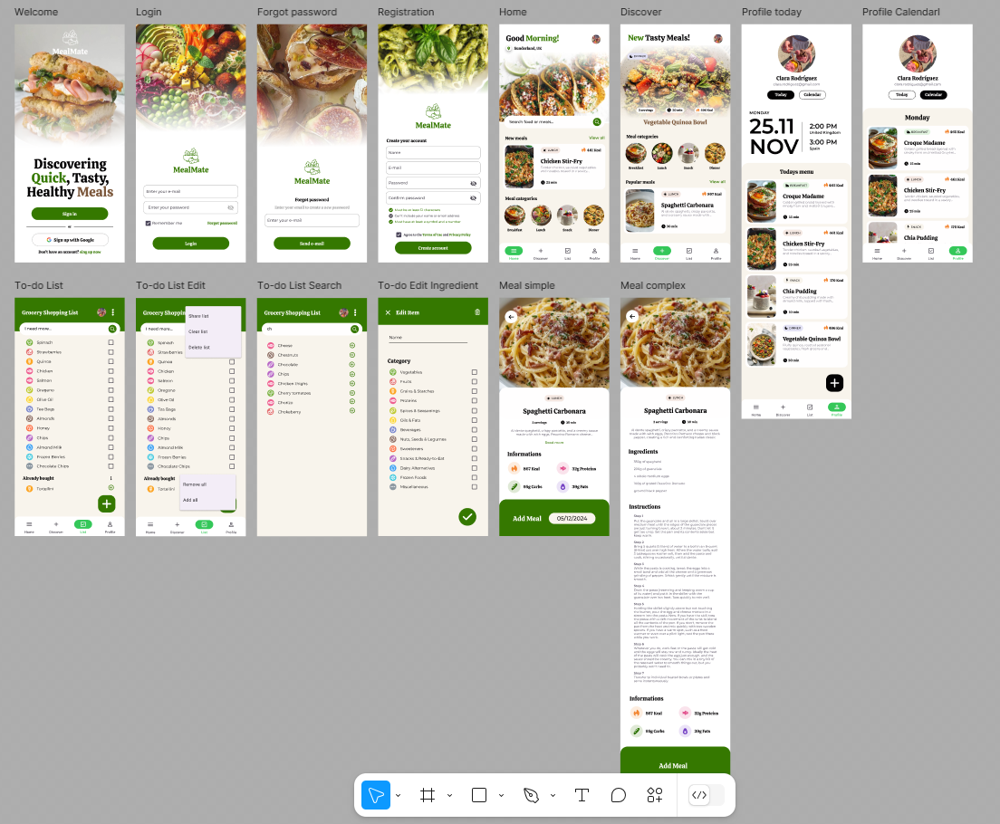
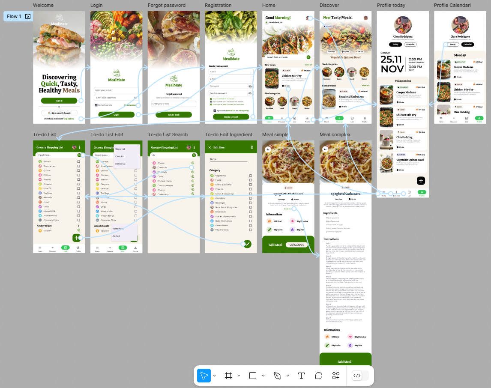

# 📱 Mealmate

  
 

      

MealMate is a personalized Android mobile application developed to streamline meal planning, recipe discovery and grocery list management for health-conscious users. Built using Firebase, Android Studio and Material Design, the app integrates smart location services, responsive UI, and real-time database synchronization to create a smooth and user-centric experience.

## 🔧 Technologies Used
- **Programming Language**: Java
- **IDE**: Android Studio
- **UI Framework**: Material Design
- **Authentication**: Firebase Authentication SDK, Google Play Services Auth
- **Database**: Firebase Realtime Database, Firestore
- **Storage**: Firebase Storage- **Image Loading**: Glide, Picasso
- **Location Services**: Android Location APIs, Geocoder
- **Date & Time**: Java Calendar & SimpleDateFormat
- **Testing**: Android Instrumented UI Tests

## ✨ Key Features
### 👥 User Authentication with Firebase
MealMate supports secure authentication through the Firebase Authentication SDK, allowing users to log in using:
- Email and Password
- Google Sign-In (via Google Play Services Auth Library)

This dual integration ensures a seamless and secure login experience while maintaining user session persistence and token management on Firebase’s end.

### 🔐 Forgot Password
A built-in "Forgot Password" feature allows users to recover access via a password reset email. This is implemented using Firebase and includes email validation feedback and error handling for invalid or empty input.

### 🔄 Data Storage and Management
MealMate utilizes Firebase’s ecosystem for real-time and scalable data operations:

#### 🗃 Firebase Realtime Database
Used for hierarchical and user-specific data such as meal plans, daily schedules and shopping lists. It ensures instant synchronization across devices and is leveraged for features requiring real-time updates, such as: ingredient changes, meal planning and shopping list toggles.

#### 📂 Cloud Firestore
Manages structured and queryable data, such as ingredient categories and meal metadata, allows complex indexing and filtering, particularly in the Discover and List views.It enhances searchability and structured sorting with optimized performance for static datasets.

#### 🖼 Firebase Storage
Stores all meal images and user-generated content securely. It's connected with Firestore and Realtime Database through downloadable URLs so it ensures scalable and cost-effective handling of media assets.

### 🧑‍🍳 User Experience
- **Interactive Navigation**: Bottom navigation bar and intuitive transitions enhance ease of use.
- **Localization Support**: Meal schedules and time data are adapted for both UK and Spain time zones.
- **Accessibility-Focused Design**: WCAG-compliant fonts, color contrast and dynamic screen density optimization.
- **Motion design**: Custom transition animations between activities, micro-interactions for button states and functional animations for list operations

### 🧭 Main Screens & Functionalities
| Screen | Highlights |
| :-----: | :---: |
| Welcome | Sign in, sign up, or authenticate with Google |
| Login/Register | Field validation, policy agreement, forgot password support |
| Home | User location, new meals diplayed and categories with quick navigation |
| Discover | Browse trending meals with category filters |
| List | Edit/delete groceries, swipe-to-edit, SMS sharing, shake-to-clear functionalities |
| Profile | View/edit meal schedules with calendar, timezone localization and meal creation support |
| Meal Detail | View or edit meal info, schedule to calendar, image upload to Firebase |
| Create/Edit Meal | Form validations and image preview integration with Firebase Storage |

### 🍽 Meal Management
- **Meal Details**: Basic and advanced meal views with scheduling and ingredient parsing.
- **Create/Edit Meal**: Fully validated form with nutritional info, images, and Firebase storage integration.

## 🎨 Design Summary
- **Material Design Compliance**: Modern UI elements with custom gradients, shadows and animations.
- **Typography**: Calistroga in headings to create a strong visual identity and Montserrat in the body to ensure optimal readability.
- **Color Systems**: Dual palettes for macronutrients and ingredient types to aid quick user decisions.
- **Wireframing & Mockups**: Designed using GoodNotes & Figma.

1. Wireframe made with GoodNotes

1. Mockup made with Figma

  
1. Mockup navigation made with Figma 

### 🧠 Design Philosophy
- Accessibility-first approach (WCAG-compliant)
- Custom UI components: navigation bar, edit texts, toasts, gradients
- Device-independent screen density optimization (hdpi–xxxhdpi)
- Strategic use of Glide (performance) and Picasso (simplicity) for image caching

## 🧪 Testing Strategy
- **UI Tests**: Navigation flow and component existence validated for key activities (WelcomeActivityTest and TermsPrivacyActivityTest).

### Future Improvements:
- Edge case and regression testing
- Performance and usability tests
- Full Test-Driven Development (TDD) integration

## 🚀 Future Enhancements
- Facebook & Microsoft authentication options
- Ingredient quantity support
- Favorite meals functionality
- Voice search and natural language ingredient input
- Clipboard-based list sharing (e.g., WhatsApp)

## 🤝 How to Contribute
Contributions are welcome! To get started:

1. Fork this repository
2. Create a feature branch `git checkout -b feature/YourFeature`
3. Commit your changes `git commit -m 'Add some feature'`
4. Push to your branch `git push origin feature/YourFeature`
5. Open a pull request

Please ensure your code follows clean architecture principles and includes appropriate comments or documentation when relevant.

## 📄 License
This project is licensed under the MIT License.

> [!WARNING]  
> Inside the file `src/main/res/values/strings.xml`, there is a string entry with name="web_id" that includes API keys directly in source code. 
>
> In this case, **there is no risk, as the original Firebase project has been permanently deleted** and the key no longer holds any functional access or value.
>
> Including API keys directly in source code is not recommended because they can be easily extracted and abused by others, its unauthorized use may lead to data breaches, unexpected billing or service denial and it violates Firebase and Google Cloud best practices. **In production apps, use `.env` files, Gradle properties or secret management tools to securely manage API credentials.**